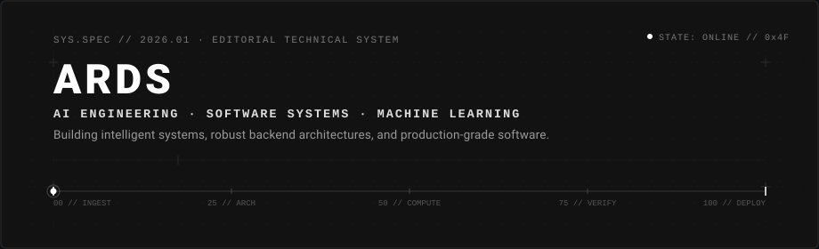
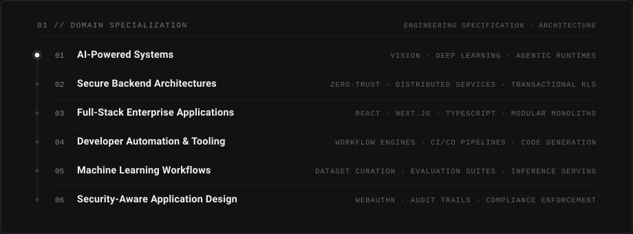

<picture>
  <source media="(prefers-color-scheme: dark)" srcset="./assets/hero-dark.svg">
  <source media="(prefers-color-scheme: light)" srcset="./assets/hero-light.svg">
  
</picture>

<div align="center">

[](https://github.com/RaymundGerardReyes/RaymundGerardReyes/releases/tag/v3.1.0)
[](./CHANGELOG.md)
[](./VERSION)

</div>

## 01 / ENGINEERING FOCUS

<picture>
  <source media="(prefers-color-scheme: dark)" srcset="./assets/focus-dark.svg">
  <source media="(prefers-color-scheme: light)" srcset="./assets/focus-light.svg">
  
</picture>

## 02 / TECHNOLOGY

A static, production-verified system inventory categorized by architectural layer. Kept strictly unadorned.

| Tier | Runtimes, Languages &amp; Infrastructure |
| :--- | :--- |
| **Languages** | `C#` &middot; `Java` &middot; `Python` &middot; `TypeScript` &middot; `JavaScript` &middot; `SQL` &middot; `Go` |
| **AI / Machine Learning** | `PyTorch` &middot; `TensorFlow` &middot; `OpenCV` &middot; `YOLOv8` &middot; `ONNX Runtime` &middot; `Vector Embeddings` |
| **Backend &amp; Services** | `.NET Core` &middot; `Spring Boot` &middot; `FastAPI` &middot; `Node.js` &middot; `gRPC` &middot; `REST Interfaces` |
| **Frontend &amp; Application** | `React` &middot; `Next.js` &middot; `Angular` &middot; `React Native` &middot; `Tailwind CSS` |
| **Data &amp; Persistence** | `PostgreSQL` &middot; `MySQL` &middot; `Redis` &middot; `Entity Framework Core` &middot; `Prisma` |
| **Infrastructure &amp; Security** | `Docker` &middot; `Linux` &middot; `Git` &middot; `CI/CD Pipelines` &middot; `WebAuthn / FIDO2` &middot; `RBAC` |

## 03 / ENGINEERING ACTIVITY

<picture>
  <source media="(prefers-color-scheme: dark)" srcset="./assets/activity-dark.svg">
  <source media="(prefers-color-scheme: light)" srcset="./assets/activity-light.svg">
  
</picture>

> Public source code, system architectures, and verifiable implementations are directly indexed across the repositories above.

## 04 / CURRENTLY EXPLORING

```text
[01] Multi-Agent Autonomous Runtimes & Distributed Orchestration
[02] Zero-Trust Backend Boundaries & Cryptographic Identity (WebAuthn)
[03] Low-Latency Tensor Quantization & Edge Computer Vision
[04] Deterministic Distributed State Machines & Audit Traceability
```

## 05 / CONNECT

<div align="left">

[](https://github.com/RaymundGerardReyes)
[](https://linkedin.com/in/raymundgerardreyes)
[](mailto:raymundgerardreyes@gmail.com)
[](https://raymundgerardreyes.github.io)

</div>

<br />

---

<div align="center">
  <sub>ARDS &middot; RAYMUND GERARD REYES &middot; RELEASE v3.1.0 &middot; THEME-ADAPTIVE COMPUTATIONAL MINIMALISM</sub>
</div>
