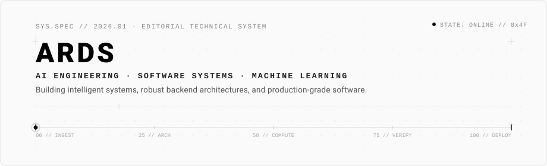
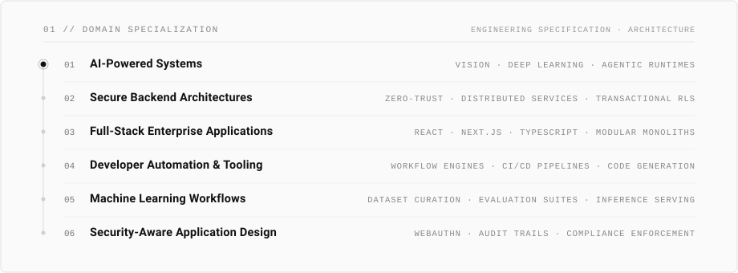
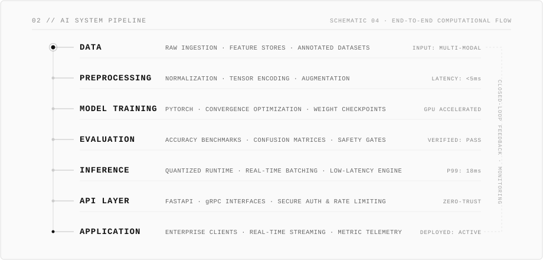

<picture>
  <source media="(prefers-color-scheme: dark)" srcset="./assets/hero-dark.svg" />
  <source media="(prefers-color-scheme: light)" srcset="./assets/hero-light.svg" />
  
</picture>

<br />

## 01 / ABOUT

AI engineer and software systems architect specializing in intelligent systems, high-assurance backend architectures, and production-grade machine learning pipelines. My work bridges foundational research and resilient distributed applications—focusing on deterministic execution, low-latency inference runtimes, zero-trust security boundaries, and automated developer tooling.

<br />

## 02 / FOCUS

<picture>
  <source media="(prefers-color-scheme: dark)" srcset="./assets/focus-dark.svg" />
  <source media="(prefers-color-scheme: light)" srcset="./assets/focus-light.svg" />
  
</picture>

<br />

## 03 / SYSTEM

<picture>
  <source media="(prefers-color-scheme: dark)" srcset="./assets/pipeline-dark.svg" />
  <source media="(prefers-color-scheme: light)" srcset="./assets/pipeline-light.svg" />
  
</picture>

<br />

## 04 / TECHNOLOGY

A restrained, production-tested technology inventory. Kept strictly static and classified by system tier.

| Domain | Systems & Tooling |
| :--- | :--- |
| **Languages** | `C#` &middot; `Java` &middot; `Python` &middot; `TypeScript` &middot; `JavaScript` &middot; `SQL` &middot; `Go` |
| **AI & ML Runtimes** | `PyTorch` &middot; `TensorFlow` &middot; `OpenCV` &middot; `YOLOv8` &middot; `ONNX Runtime` &middot; `NumPy` &middot; `Scikit-Learn` |
| **Backend & Services** | `.NET Core` &middot; `Spring Boot` &middot; `FastAPI` &middot; `Node.js` &middot; `Express` &middot; `REST / gRPC` |
| **Frontend Architectures** | `React` &middot; `Next.js` &middot; `Angular` &middot; `Tailwind CSS` &middot; `React Native` |
| **Data & Storage** | `PostgreSQL` &middot; `MySQL` &middot; `Redis` &middot; `Prisma` &middot; `EF Core` &middot; `Vector Stores` |
| **Infrastructure & Security** | `Docker` &middot; `Linux` &middot; `Git` &middot; `CI/CD Workflows` &middot; `WebAuthn` &middot; `Zero-Trust RBAC` |

<br />

## 05 / SELECTED SYSTEMS

Detailed engineering systems designed with architectural rigor, clear boundary isolation, and measurable verification.

---

### 01 &middot; REAL-TIME MEDICAL EMERGENCY DETECTION
**Domain:** Deep Learning &middot; Pose Estimation &middot; Edge Inference &middot; Video Processing

* **Problem Statement:** Identifying acute medical emergencies (falls, convulsions, loss of consciousness) in assisted-living and medical facilities from continuous video streams without relying on invasive wearables.
* **Architecture:**
  ```text
  Continuous Video Stream
            │
            ▼
  YOLOv8-Pose Extractor (17 Skeletal Keypoints)
            │
            ▼
  Temporal Feature Sliding Window (ST-GCN / Bidirectional LSTM)
            │
            ▼
  Multi-Class Confidence Classifier (Loss & Margin Benchmarks)
            │
            ▼
  Asynchronous Alert Dispatcher (FastAPI + WebSockets Gateway)
  ```
* **Technologies:** `Python` &middot; `PyTorch` &middot; `FastAPI` &middot; `OpenCV` &middot; `PostgreSQL` &middot; `React Native`
* **Evidence:** [Repository](https://github.com/RaymundGerardReyes) &middot; [Architecture Document](https://github.com/RaymundGerardReyes)

---

### 02 &middot; CEDO EPMS (EDUCATION PROGRAM MANAGEMENT)
**Domain:** Full-Stack Enterprise Platform &middot; Granular Security &middot; Multi-Tenant Orchestration

* **Problem Statement:** Eliminating fragmented coordination, manual spreadsheets, and security audit gaps across multi-institution educational and training workflows.
* **Architecture:**
  ```text
  Client Interface (Next.js SSR + TypeScript)
            │
            ▼
  Stateless API Gateway (Go / Gin Engine)
            │
            ▼
  Domain Services with Row-Level Security (RLS) & Role-Based Access Control (RBAC)
            │
            ▼
  Transactional Persistence (PostgreSQL with Append-Only Audit Trail)
  ```
* **Technologies:** `Next.js` &middot; `Go` &middot; `PostgreSQL` &middot; `Tailwind CSS` &middot; `Docker`
* **Evidence:** [Repository](https://github.com/RaymundGerardReyes) &middot; [System Specification](https://github.com/RaymundGerardReyes)

---

### 03 &middot; SECURE TRANSACTION & BANKING PLATFORM
**Domain:** High-Assurance Backend &middot; Distributed Transactions &middot; Cryptographic Auth

* **Problem Statement:** Preventing credential compromise, replay attacks, and state inconsistency in high-frequency financial and balance ledger transactions.
* **Architecture:**
  ```text
  Client Assertion (FIDO2 / WebAuthn Hardware Authenticator)
            │
            ▼
  Spring Security Gateway (Nonced Cryptographic Handshake)
            │
            ▼
  ACID Transactional State Machine (Two-Phase Verification)
            │
            ▼
  PostgreSQL Enterprise Storage (Cryptographically Signed Audit Log)
  ```
* **Technologies:** `Java` &middot; `Spring Boot` &middot; `PostgreSQL` &middot; `WebAuthn / FIDO2` &middot; `Docker`
* **Evidence:** [Repository](https://github.com/RaymundGerardReyes) &middot; [Security Model](https://github.com/RaymundGerardReyes)

---

### 04 &middot; QA & QUALITY MANAGEMENT SYSTEM (QMS)
**Domain:** Enterprise Workflow Engine &middot; Clean Architecture &middot; Domain-Driven Design

* **Problem Statement:** Standardizing quality assurance auditing, non-conformance logging, and organizational corrective action plans with verifiable traceability.
* **Architecture:**
  ```text
  Enterprise Angular / React Client
            │
            ▼
  ASP.NET Core Clean Architecture (CQRS Pattern via MediatR)
            │
            ▼
  Domain Validation Rules & Workflow State Machine
            │
            ▼
  PostgreSQL Database with Immutable Historical Snapshots
  ```
* **Technologies:** `C#` &middot; `.NET Core` &middot; `PostgreSQL` &middot; `Docker` &middot; `Entity Framework Core`
* **Evidence:** [Repository](https://github.com/RaymundGerardReyes) &middot; [Design Document](https://github.com/RaymundGerardReyes)

<br />

## 06 / GITHUB ACTIVITY

Minimalist, theme-synchronized telemetry tracking public code contributions and core language distribution.

<div align="center">
  <picture>
    <source media="(prefers-color-scheme: dark)" srcset="https://github-readme-stats.vercel.app/api?username=RaymundGerardReyes&show_icons=true&include_all_commits=true&count_private=true&hide_border=false&title_color=ffffff&text_color=999999&icon_color=ffffff&bg_color=121212&border_color=262626" />
    <source media="(prefers-color-scheme: light)" srcset="https://github-readme-stats.vercel.app/api?username=RaymundGerardReyes&show_icons=true&include_all_commits=true&count_private=true&hide_border=false&title_color=000000&text_color=555555&icon_color=111111&bg_color=fafafa&border_color=e5e5e5" />
    
  </picture>
  <picture>
    <source media="(prefers-color-scheme: dark)" srcset="https://github-readme-stats.vercel.app/api/top-langs/?username=RaymundGerardReyes&layout=compact&hide_border=false&title_color=ffffff&text_color=999999&bg_color=121212&border_color=262626" />
    <source media="(prefers-color-scheme: light)" srcset="https://github-readme-stats.vercel.app/api/top-langs/?username=RaymundGerardReyes&layout=compact&hide_border=false&title_color=000000&text_color=555555&bg_color=fafafa&border_color=e5e5e5" />
    
  </picture>
</div>

<br />

## 07 / CONTACT

Open for technical collaborations, artificial intelligence systems design, and production engineering initiatives.

<div align="left">

[](https://linkedin.com/in/raymundgerardreyes)
[](https://github.com/RaymundGerardReyes)
[](mailto:raymundgerardreyes@gmail.com)
[](https://raymundgerardreyes.github.io)

</div>

<br />

---

<div align="center">
  <sub>ARDS &middot; RAYMUND GERARD REYES &middot; SPECIFICATION 2026.01 &middot; MINIMALIST EDITORIAL SYSTEMS DESIGN</sub>
</div>
